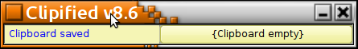
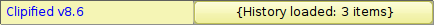
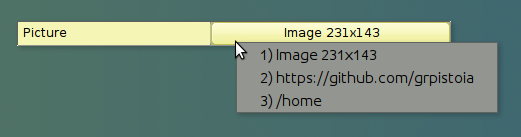
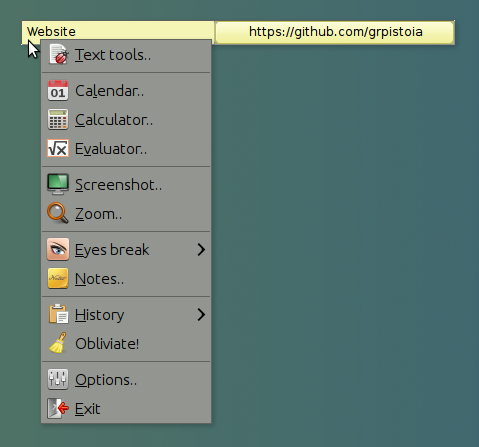
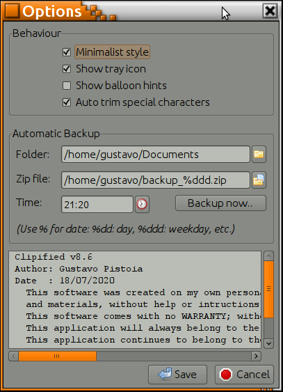
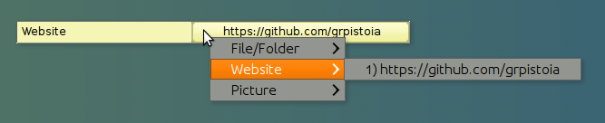

# Clipified

## Clipboard management and handy tools

This application is designed to store recent items you copied into the clipboard, so you can retrieve them later on.

It is useful when you jump from one task to another dealing with lots of text or numbers, or as very quick way to save text you typed.

Each time you copy to the clipboard (normally pressing either [CTRL]+[C] or [SHIFT]+[INSERT] or via a menu), the clipboard is analysed and stored for future retrieval. A few basic formats are supported such as unformatted text, email address, web addresses, file names & folders, and some picture formats. Around 200 items are kept and eventually the oldest item (or least relevant item) will be discarded. If the computer is rebooted, those last used items will be restored.

Notice any formatting of the text will not be restored (colour, bold, italics, etc.); only unformatted text will be restored, nevertheless, any current formatted text in the clipboard will not be modified. The application was written in Lazarus on Linux and ported to Windows, therefore some formats will not be supported and will be not be saved. Any format will be converted as text if possible to be saved (for instance, large set of values in Excel).

The application is designed to run in the background. It can run in two display styles, either with title-bar & border, or using the least space possible. Here is a screenshot on Linux running on classic style with title-bar and border:

Here is a screenshot on a minimalist style:

The display style can be changed by the Options menu, or simply double clicking on the yellow area.

## Basic behaviour

Each time an item is copied to the clipboard the application will analyse it and display part of the text copied for later reference. In case of images, the size of the image will be displayed.

## History button

By clicking in the button on the right side of the application you can see a drop-down menu with the recent items you copied to the history. Simply click in the item desired and the text or image will be restored to the clipboard.

## Main popup menu

By right clicking on the left side of the application you will have access to lots of efficiency tools, especially when dealing with data, code, numbers or screenshots.

There are lots of interesting features in this menus, that can be learned only by using it. The following is a small description:

**Text tools** : This menu will open an editor that will allow you to manipulate the text quickly. Has features such as trimming the text (remove spaces and tabs), indent, unindent, sort alphabetically, change to uppercase or lowercase, etc. It supports not only selecting text in standard mode (from the start to the current cursor line), but also selecting in rectangular mode using [ALT]+[SHIFT] and the cursor keys or mouse. It will also allow to you replace text on the fly, for instance, you can quickly change hundred numbers in multiple lines into 1 line with all numbers separated by commas.

**Calendar** : It will display the days of the current month by default. The main characteristic is that it will stay open even if you go to another screen, in comparison with Windows that closes itself. If you click on the month, it will change modes and allow you to browse months rather than days. The selected date can be copied to the clipboard.

**Calculator** : Similar to a basic calculator, but remains on top of other applications so you don't need to memorise the value.

**Evaluator** : It is basically a calculator but does not require pressing [ENTER] or [=] to get the total. Instead it evaluates the expression as you type. In fact, you can continue adding terms without having to restore previous formulas. It comes with a predefined set of formulas that you can select by right-clicking on the display area. Variables X and Y can be used in the formula to quickly change values instead of modifying the formula itself.

**Screenshot** : Once you click this menu, you have a few seconds to move the mouse to the application and screen (if you have multiple displays) that you want to capture. If you open a menu it will take a screenshot including the opened menu, which is something that [PRINT] or [ALT+PRINT] cannot do. This is handy for when you are writing a manual or sending a screenshot via email. After the screenshot is taken, a small editor will appear where you can select the part of image you are interested in; simply drag and drop with the mouse the area you want to cut. During that process you can use the [CONTROL] key to increase the zoom preview for fine details or use the [ALT] key to add a border to the final image. Once you are done, the clipboard will contain that selected image.

**Zoom** : This menu will open a small preview screen zooming in the area around the mouse. The zoom preview window can be made bigger if you require to see more. The zoom preview will not zoom itself but instead become transparent for when you need to see behind it. Most times users want to zoom on a fixed image, for instance, a part of application, so the image zoomed is actually static; therefore moving near the clock you will notice the time does not change. Basically the zoom acts like zooming a photograph. If that is not behaviour you want, but you need to zoom on the current changing desktop, just simply press [SHIFT] key and the zoom will refresh as you move the mouse. The [ALT] key will freeze the movement at the current mouse position, allowing you to copy a zoomed text to another application.

**Eyes break** : This option will allow you to setup an alert on a few predefined deadlines (30min, 1h, 2h, 4h) to remind you to have a some rest. If you have not taken a break during that time, the application will show an alert. If the computer was iddle for few minutes, or the screen saver gets activated, the time will be considered a rest, and the alert counter will restart when you return. Notice that there are cases that Windows does not report the screen saver as active (Start menu for instance), or cases where the keys sent to other applications are not reported (probably for security reasons), so the mouse movement is registered as change.

**Notes** : This option will allow you to save name, phones, emails or other information quickly, very handy when you are on the phone and ran out of postix (especially when you don´t have 30min to wait for Outlook to open and sync folders). As soon as you press [SAVE] to close the dialogue-box the text will be stored. It will be automatically restored after you reboot the computer.

**History** : This will show the same menu in the section "*Action popup menu*". Basically displays all the clipboard history but classified by *type*, for instance, all files together, all websites together, etc.

**Obliviate!** : This menu will erase all the history, both from the registry (200+ items which get saved and loaded each time) and also from the export text file in your temp folder. This action cannot be undone, once selected and confirmed, the data is forever lost, and the current clipboard gets erased too.

**Options** : This dialogue-box allow you to change a couple of preference settings. They are self-explanatory and have help hints. There is a special tool in this screen to allow you create a ZIP file of a single folder; you can select the name the folder to backup (normally your working directory), select the final zip file name, and the time during the day when run the backup (assuming the computer is on). Keep in mind this is not designed to be your only backup mechanism, but as quick process for when you have no time to setup complex backup tools.

**Exit** : This menu will close the application and release memory, but leaving the current clipboard as is. History should be reloaded once you open the application again.

## Action popup menu

By right clicking on the right side of the application on top of the button a special popup menu will appear. This menu displays all the clipboard history classified by type. Folder & files, websites, emails and pictures are displayed separately. That way you can restore the item you are after without looking on the long list. Classified items will be prioritised to be kept for longer, because they are more relevant than random text in the clipboard. Clicking in this action menus will not just restore the information to the clipboard, but also will trigger an action. For instance, clicking on an email address item will open your default email application (same like mail-to on websites), or clicking on a website will open your default browser and open the website.

This application assumes only you use your computer with your user id, which is how the information is kept protected. Information is kept in the registry under your user and a full copy as a temporary file in your temp folder. Deleting your user profile in your machine will destroy the information. You can also use the popup menu to destroy all information, especially if you want to uninstall it.

Hope saves you time as it did for me.

Gustavo.

PS:

Read the full license for more information.

THE SOFTWARE IS PROVIDED "AS IS", WITHOUT WARRANTY OF ANY KIND, EXPRESS OR IMPLIED, INCLUDING BUT NOT LIMITED TO THE WARRANTIES OF MERCHANTABILITY, FITNESS FOR A PARTICULAR PURPOSE AND NONINFRINGEMENT. IN NO EVENT SHALL THE AUTHORS OR COPYRIGHT HOLDERS BE LIABLE FOR ANY CLAIM, DAMAGES OR OTHER LIABILITY, WHETHER IN AN ACTION OF CONTRACT, TORT OR OTHERWISE, ARISING FROM, OUT OF OR IN CONNECTION WITH THE SOFTWARE OR THE USE OR OTHER DEALINGS IN THE SOFTWARE.
